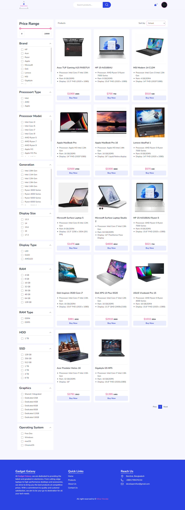

# Gadget Galaxy (a NextJs e-commerce web application)
This is a full-stack e-commerce website built with Next.js, TailwindCSS, Redux Toolkit, RTK Query, NodeJs, Express.js, Prisma, and MongoDB. The application is designed for a seamless shopping experience, providing functionalities like product sorting, filtering, and search, along with an integrated Stripe payment system and user authentication.

**If you like it please give a star ⭐**    

### Available pages
* Home page: /
* Products page: /product
* Single product page: /product/1
* Offered product page: /offer/1
* Cart page: /cart
* Login page: /sign-in
* Register page: /sign-up
* 404 page

### Screenshots



### Features
* Next.js: Utilized for server-side rendering (SSR) to fetch products, improving SEO and performance.
* TailwindCSS: For a fully responsive and modern UI/UX.
* Redux Toolkit: For efficient state management across the application.
* RTK Query: Simplifies data fetching and caching for API calls.
* Prisma: ORM for handling database operations with MongoDB.
* Express.js: Backend API development.
* Stripe: Integrated for secure payment processing.
* Authentication: User authentication and authorization system.
* Product Management: Sorting, filtering, and search functionalities to help users find the desired products easily.
### Technologies Used
* Frontend:
  * Next.js
  * TailwindCSS
  * Redux Toolkit
  * RTK Query

* Backend:
  * Express.js
  * Prisma
  * MongoDB
  
* Payment System:
  * Stripe
### Installation
#### Clone the Repository
```bash
git clone https://github.com/NiharMondal/gadget-galaxy
cd gadget-galaxy
```
#### Install Dependencies
```bash
npm install
```
#### Set Up Environment Variables
Create a __.env__ file in the root directory and add your environment variables as follows:

```bash
NEXT_PUBLIC_CLOUDINARY_CLOUD_NAME="your cloud name"

NEXT_PUBLIC_BACKEND_URL = "http://localhost:5000/api/v1"

NEXT_PUBLIC_BACKEND_URL_PRODUCTION = "your backend deployed live link"
NEXT_PUBLIC_STRIPE_PUBLISHED_KEY="your stripe published key"
```
#### Run the Application
To start the development server, run:

```bash
npm run dev
```
The application will be available at http://localhost:3000.

Features Overview
1. Product Display with SSR
Products are fetched using server-side rendering for better SEO and faster load times.
2. Sorting, Filtering, and Search
Users can sort products by price, popularity, etc.
Filter products based on categories, features, and other attributes.
Search for products using a custom search bar.
3. Redux Toolkit & RTK Query
Efficient state management with Redux Toolkit.
RTK Query for handling API calls and caching the results.
4. User Authentication
Sign up, log in, and access protected routes using JSON Web Tokens (JWT).
5. Stripe Integration
Seamless payment experience with Stripe integration.

#### Future Improvements
* Add more payment gateways.
* Implement real-time notifications for order updates.
* Improve user dashboard with order history and tracking.


**Backend GitHub Link**   

[Gadget Galaxy Backend](https://github.com/NiharMondal/gadget-galaxy-backend)